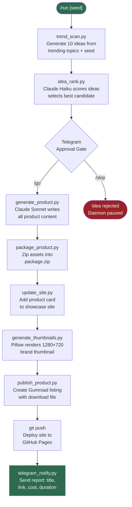
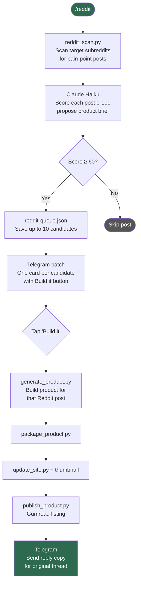
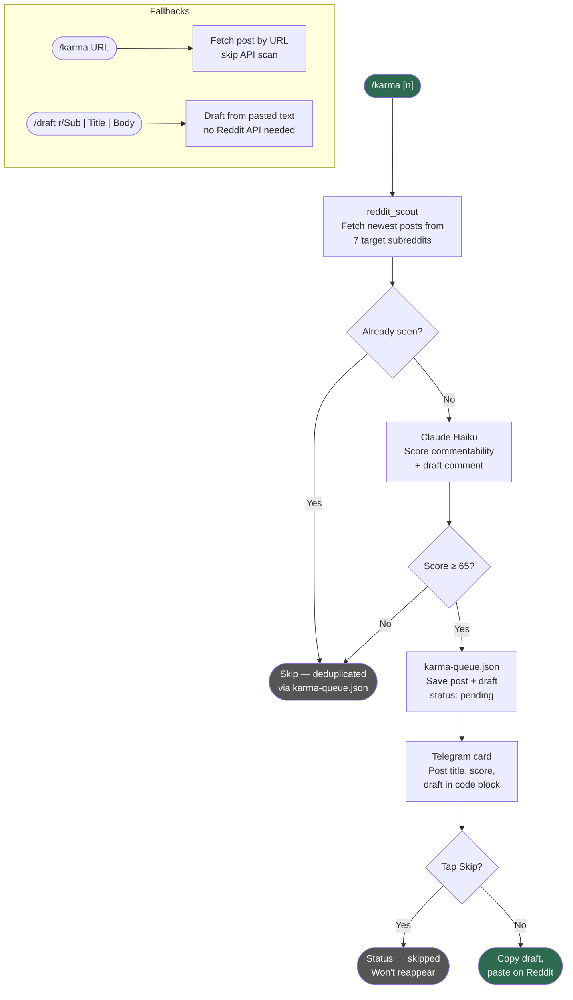
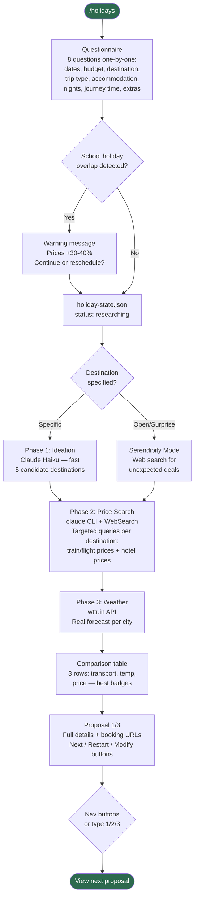
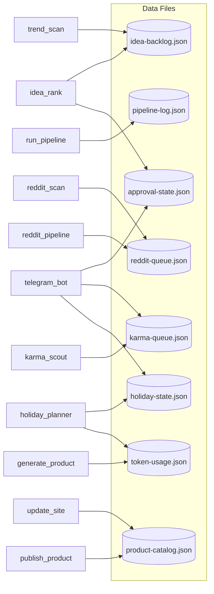

# mini-on-ai


An AI-powered digital product factory running on a Mac mini. It scans Reddit for unmet needs, generates matching products, publishes them to Gumroad, and manages Reddit karma — all controlled from Telegram.

Visitors can also generate a **custom product on-demand** via the [Build Your Own](https://mini-on-ai.com/build.html) page: describe a use case, preview the output for free, download for $9.

**Live site:** [mini-on-ai.com](https://mini-on-ai.com)

---

## Pipelines

### 1. Product Factory Pipeline

Triggered by `/run` in Telegram or the background daemon. Generates a product from trending topics or a keyword seed.



---

### 2. Reddit Demand Pipeline

Triggered by `/reddit` in Telegram. Finds real unmet needs on Reddit, then builds a product for any you approve.



---

### 3. Karma Scout Pipeline

Triggered by `/karma` in Telegram. Finds posts worth commenting on to build Reddit karma organically.



---

### 4. Holiday Planner Pipeline

Triggered by `/holidays` in Telegram. Interactive trip planner with real web search and weather.



---

### 5. Data & State Flow

How scripts share state across the factory.



---

## Telegram Commands

| Command | Description |
|---|---|
| `/run [seed] [category]` | Generate a product (optional keyword + category) |
| `/run all` | Run 4 pipelines (marketing, freelancing, writing, coding) |
| `/go` | Approve pending idea → build it |
| `/skip` | Skip pending idea |
| `/blog [topic]` | Generate + publish SEO blog post (auto-picks topic if omitted) |
| `/blast` | Draft email campaign → inline Send / Regenerate buttons |
| `/tweet [list\|pid]` | Draft tweet for latest un-tweeted product |
| `/missing [list\|N]` | List products without Gumroad URLs; get listing copy for product N |
| `/seturl {pid} {url}` | Save Gumroad URL for a product, rebuild + push |
| `/setfree {pid}` | Mark a product as free, rebuild + push |
| `/gumroad [pid]` | Get Gumroad listing copy for any product |
| `/syncprices` | Sync prices from Gumroad API to local catalog |
| `/reddit` | Scan Reddit, propose up to 10 products |
| `/karma [n\|url]` | Find posts to comment on for karma building |
| `/draft r/Sub \| Title \| Body` | Draft Reddit comment from pasted text (no API) |
| `/status` | Last run, product count, API costs |
| `/products` | All published products with links |
| `/tokens` | Lifetime API cost breakdown by model and stage |
| `/ideas` | Top scored ideas in the backlog |
| `/categories` | Show all product categories |
| `/pause` / `/resume` | Pause / resume the background daemon |
| `/holidays` | Interactive trip planner (personal feature) |

---

## Project Structure

```
mini-on-factory/
├── scripts/
│   ├── run_pipeline.py        — product factory orchestrator
│   ├── reddit_pipeline.py     — demand-driven pipeline (Reddit → build)
│   ├── karma_scout.py         — Reddit karma building (find + draft comments)
│   ├── holiday_planner.py     — trip planner (3-phase research + wttr.in weather)
│   ├── telegram_bot.py        — Telegram command interface + polling loop
│   ├── telegram_notify.py     — message formatting + send helpers
│   ├── trend_scan.py          — idea generation from trending topics
│   ├── idea_rank.py           — score and select best idea (Claude Haiku)
│   ├── generate_product.py    — generate product content (Claude Haiku)
│   ├── package_product.py     — zip product assets
│   ├── update_site.py         — rebuild all site HTML + sitemap + blog index
│   ├── generate_thumbnails.py — Pillow-rendered 1280×720 thumbnails
│   ├── generate_blog_post.py  — SEO blog post via Claude Haiku
│   ├── email_blast.py         — Brevo email campaign sender
│   ├── publish_product.py     — Gumroad API: create/update listings
│   ├── reddit_scan.py         — scan subreddits for pain-point posts
│   └── lib/
│       ├── claude_cli.py      — wrapper for claude CLI (Pro subscription)
│       ├── utils.py           — shared helpers (JSON, logging, paths)
│       └── trend_sources.py   — subreddit + keyword lists
├── worker/
│   ├── generate.js            — CF Worker: Build Your Own (Anthropic + Stripe + ZIP)
│   └── subscribe.js           — CF Worker: Brevo email subscribe proxy
├── data/
│   ├── product-catalog.json   — published products
│   ├── idea-backlog.json      — idea candidates
│   ├── blog-posts.json        — published blog posts
│   ├── reddit-queue.json      — Reddit posts + build status
│   ├── karma-queue.json       — comment drafts + skip status
│   ├── holiday-state.json     — active holiday planning session
│   ├── approval-state.json    — pending /go or /skip decision
│   ├── token-usage.json       — per-run API cost tracking
│   └── pipeline-log.json      — run history
├── products/                  — one folder per product
│   └── {id}/
│       ├── meta.json
│       ├── package.zip
│       └── assets/
└── site/                      — static showcase (Cloudflare Pages)
    ├── index.html             — rebuilt by update_site.py
    ├── style.css              — Dark Premium design system
    ├── build.html             — Build Your Own interactive page
    ├── _headers               — Cloudflare Pages security headers
    ├── blog/
    └── products/{id}.html
```

---

## Stack

| Layer | Tool |
|---|---|
| AI generation | Claude Sonnet (content), Claude Haiku (scoring/ranking) |
| Web research | Claude CLI `--allowedTools WebSearch` (Pro subscription) |
| Reddit data | `api.reddit.com/r/{sub}/new` — no auth required |
| Weather | [wttr.in](https://wttr.in) — free, no API key |
| Publishing | Gumroad API |
| Notifications | Telegram Bot API (polling, inline buttons) |
| Site hosting | Cloudflare Pages (static HTML, Dark Premium design) |
| Build Your Own | Cloudflare Workers + Stripe + Anthropic Haiku |
| Email | Brevo API via Cloudflare Worker proxy |
| Thumbnails | Pillow (Python image library) |
| Scheduling | launchd plist on Mac mini |

---

## Setup

```bash
git clone https://github.com/abenjelloun1989/mini-on-ai
cd mini-on-ai
pip3 install anthropic python-dotenv pillow

cp .env.example .env
# Fill in: ANTHROPIC_API_KEY, TELEGRAM_BOT_TOKEN, TELEGRAM_OWNER_ID, GUMROAD_API_TOKEN, SITE_URL
```

Run manually:

```bash
python3 scripts/run_pipeline.py --seed "marketing"
python3 scripts/run_pipeline.py --reddit-mode
python3 scripts/telegram_bot.py
```

---

## License

All rights reserved. See [LICENSE](LICENSE) for details.
